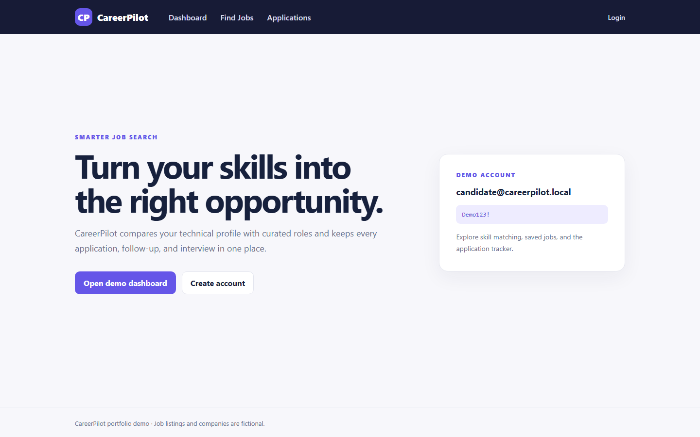

# CareerPilot

Skill-based job matching and application tracking built as a portfolio project for an IT Support / ERP Developer profile.



## What it demonstrates

- Ranks fictional job listings against a technical skill profile
- Filters opportunities by keyword, location, and match score
- Saves jobs and tracks Applied, Interview, Offer, and Rejected stages
- Stores follow-up dates and notes per signed-in user
- Lets recruiters publish jobs, close listings, and review applicants
- Lets administrators review accounts and assign role-based access
- Uses ASP.NET Core Razor Pages, Identity, EF Core, and SQLite

## Demo accounts

- Candidate: `candidate@careerpilot.local`
- Recruiter: `recruiter@careerpilot.local`
- Admin: `admin@careerpilot.local`
- Password for all accounts: `Demo123!`

## Run locally

```powershell
dotnet restore
dotnet run
```

Open the localhost URL shown in the terminal. Job listings and companies are synthetic demo data.

## Check

```powershell
dotnet build --configuration Release
dotnet run --no-build --configuration Release -- --self-check
```
